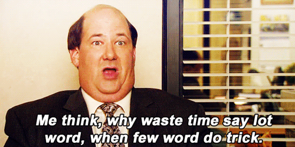

<div align="center">

  ## PromptOptimizer
  
  

  Minimize LLM token complexity to save API costs and model computations.

</div>
<div align="center">

[](https://github.com/vaibkumr/prompt-optimizer/actions/workflows/lint.yml) 
[](https://github.com/vaibkumr/prompt-optimizer/actions/workflows/test.yml) 
[](https://github.com/vaibkumr/prompt-optimizer/actions/workflows/linkcheck.yml) 
[](https://opensource.org/licenses/MIT)

[Docs](https://promptoptimizer.readthedocs.io/en/latest/)

</div>


# Features
- **Plug and Play Optimizers:** Minimize token complexity using optimization methods without any access to weights, logits or decoding algorithm. Directly applicable to virtually all NLU systems.
- **Protected Tags:** Special protected tags to mark important sections of prompt that should not be removed/modified.
- **Sequential Optimization:** Chain different optimizers together sequentially.
- **Optimization Metrics:** Number of tokens reduced and semantic similarity before and after optimization.
- **Langhcain and JSON Support:** Supports langchain style prompt chains and OpenAI request JSON Object.
 
# Why?
- **Minimize Token Complexity:** Token Complexity is the amount of prompt tokens required to achieve a given task. Reducing token complexity corresponds to linearly reducing API costs and quadratically reducing computational complexity of usual transformer models.
- **Save Money:** For large businesses, saving 10% on token count can lead to saving 100k USD per 1M USD.
- **Extend Limitations:** Some models have small context lengths, prompt optimizers can help them process larger than context documents.

| Prompt | # Tokens | Correct Response? |  
| ------------------------------------------------------- | ---------- | ------------------- |  
| Who is the president of the United States of America? | 11 | ✅ |  
| Who president US | 3  (-72%) | ✅ |

# Installation
### Quick Installation
```pip install prompt-optimizer```

### Install from source
```bash
git clone https://github.com/vaibkumr/prompt-optimizer.git;
cd prompt-optimizer;
pip install -e .
```

# Disclaimer
There is a compression vs performance tradeoff -- the increase in compression comes at the cost of loss in model performance. The tradeoff can be greatly mitigated by chosing the right optimize for a given task. There is no single optimizer for all cases. There is no Adam here.


# Getting started

```python

from prompt_optimizer.poptim import EntropyOptim

prompt = """The Belle Tout Lighthouse is a decommissioned lighthouse and British landmark located at Beachy Head, East Sussex, close to the town of Eastbourne."""
p_optimizer = EntropyOptim(verbose=True, p=0.1)
optimized_prompt = p_optimizer(prompt)
print(optimized_prompt)

```
# Evaluations
Following are the results for [logiqa](https://github.com/openai/evals/blob/main/evals/registry/evals/logiqa.yaml) OpenAI evals task. It is only performed for a subset of first 100 samples. Please note the optimizer performance over this task should not be generalized to other tasks, more thorough testing and domain knowledge is needed to choose the optimal optimizer.

| Name | % Tokens Reduced | LogiQA Accuracy | USD Saved Per $100 |
| --- | --- | --- | --- |
| Default | 0.0 | 0.32 | 0.0 |
| Entropy_Optim_p_0.05 | 0.06 | 0.3 | 6.35 |
| Entropy_Optim_p_0.1 | 0.11 | 0.28 | 11.19 |
| Entropy_Optim_p_0.25 | 0.26 | 0.22 | 26.47 |
| Entropy_Optim_p_0.5 | 0.5 | 0.08 | 49.65 |
| SynonymReplace_Optim_p_1.0 | 0.01 | 0.33 | 1.06 |
| Lemmatizer_Optim | 0.01 | 0.33 | 1.01 |
| NameReplace_Optim | 0.01 | 0.34 | 1.13 |
| Punctuation_Optim | 0.13 | 0.35 | 12.81 |
| Autocorrect_Optim | 0.01 | 0.3 | 1.14 |
| Pulp_Optim_p_0.05 | 0.05 | 0.31 | 5.49 |
| Pulp_Optim_p_0.1 | 0.1 | 0.25 | 9.52 |

# Cost-Performance Tradeoff
The reduction in cost often comes with a loss in LLM performance. Almost every optimizer have hyperparameters that control this tradeoff. 

For example, in `EntropyOptim` the hyperparamter `p`, a floating point number between 0 and 1 controls the ratio of tokens to remove. `p=1.0` corresponds to removing all tokens while `p=0.0` corresponds to removing none. 

The following chart shows the trade-off for different values of `p` as evaluated on the OpenAI evals [logiqa](https://github.com/openai/evals/blob/main/evals/registry/evals/logiqa.yaml) task for a subset of first 100 samples.

<div align="center">
  
</div>

# Contributing
There are several directions to contribute to. Please see [CONTRIBUTING.md](.github/CONTRIBUTING.md) for contribution guidelines and possible future directions.

# Social
Contact us on twitter [Vaibhav Kumar](https://twitter.com/vaibhavk1o1) and [Vaibhav Kumar](https://twitter.com/vaibhavk97).

# Inspiration
<div align="center">
  
</div>