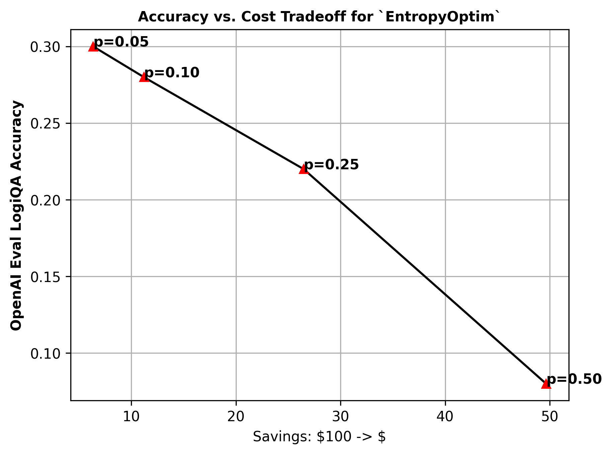

# Cost-Performance Tradeoff
The reduction in cost often comes with a loss in LLM performance. Almost every optimizer have hyperparameters that control this tradeoff. 

For example, in `EntropyOptim` the hyperparamter `p`, a floating point number between 0 and 1 controls the ratio of tokens to remove. `p=1.0` corresponds to removing all tokens while `p=0.0` corresponds to removing none. 

The following chart shows the trade-off for different values of `p` as evaluated on the OpenAI [logiqa](https://github.com/openai/evals/blob/main/evals/registry/evals/logiqa.yaml) task.

  

